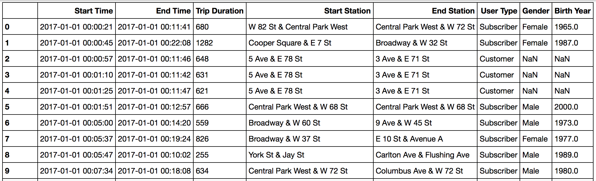

# Analysis of Bike Sahre Data

## Introduction
I've finished the : [Nonodegree Program: Programming for Data Science with Python](https://learn.udacity.com/nanodegrees/nd104) at [Udacity](https://www.udacity.com) and this project was a part of my program study.


### Bike Share Data
Over the past decade, bicycle-sharing systems have been growing in number and popularity in cities across the world. Bicycle-sharing systems allow users to rent bicycles on a very short-term basis for a price. This allows people to borrow a bike from point A and return it at point B, though they can also return it to the same location if they'd like to just go for a ride. Regardless, each bike can serve several users per day.

In this project, I used data provided by [Motivate](https://motivateco.com/), a bike share system provider for many major cities in the United States, to uncover bike share usage patterns. I compared the system usage between three large cities: Chicago, New York City, and Washington, DC.

### Dataset
Randomly selected data for the first six months of 2017 are provided for all three cities. All three of the data files contain the same core six (6) columns:

- Start Time (e.g., 2017-01-01 00:07:57)
- End Time (e.g., 2017-01-01 00:20:53)
- Trip Duration (in seconds - e.g., 776)
- Start Station (e.g., Broadway & Barry Ave)
- End Station (e.g., Sedgwick St & North Ave)
- User Type (Subscriber or Customer)
- The Chicago and New York City files also have the 

following two columns:
- Gender
- Birth Year

The data is available at /data folder.



## An Interactive Experience
There are four questions that I answered in my Python program:

1) Would you like to see data for Chicago, New York, or Washington?
2) Would you like to filter the data by month, day, or not at all?
3) (If they chose month) Which month - January, February, March, April, May, or June?
4) (If they chose day) Which day - Monday, Tuesday, Wednesday, Thursday, Friday, Saturday, or Sunday?
<br>

The answers to the questions above will determine the city and timeframe on which I'll do data analysis. After filtering the dataset, users will see the statistical result of the data, and choose to start again or exit.

For run the project please use below code:
```
>>> python bikeshare.py
```
